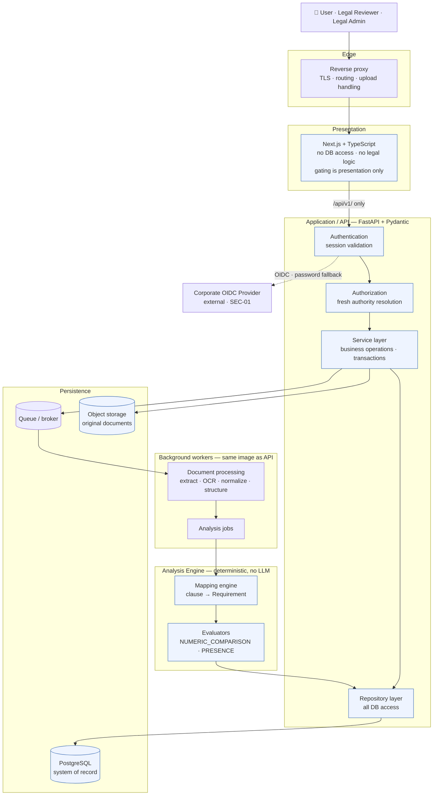
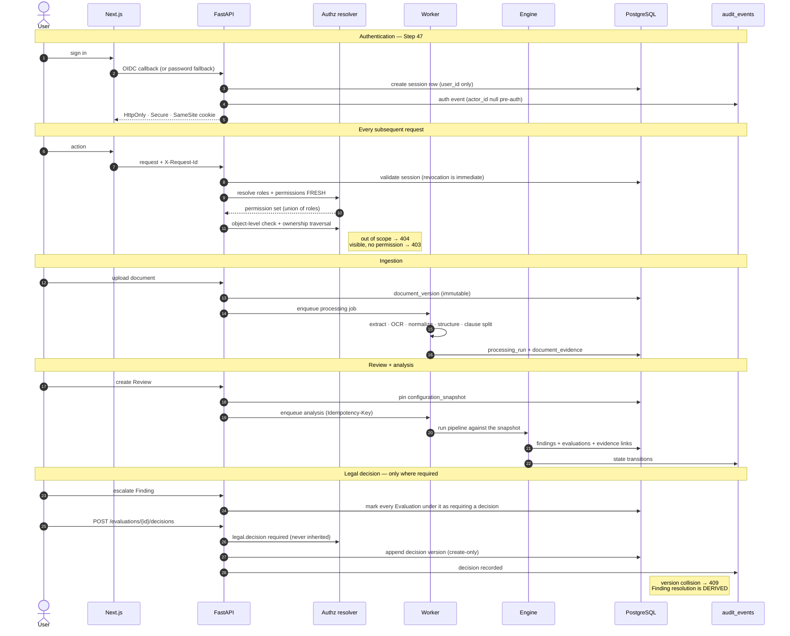
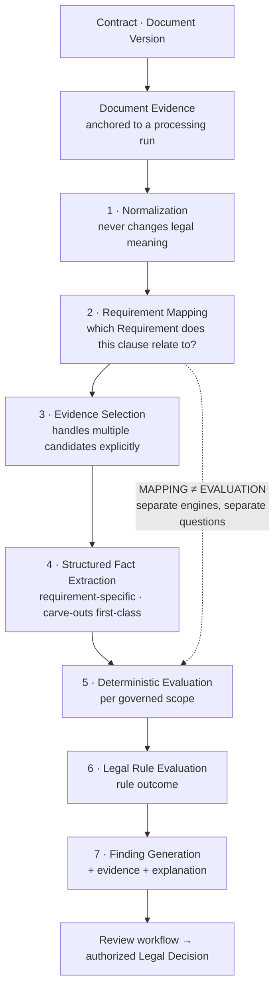
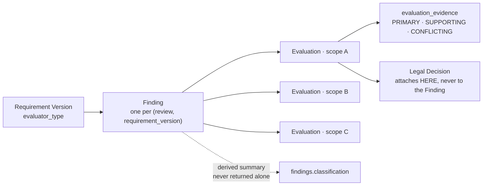
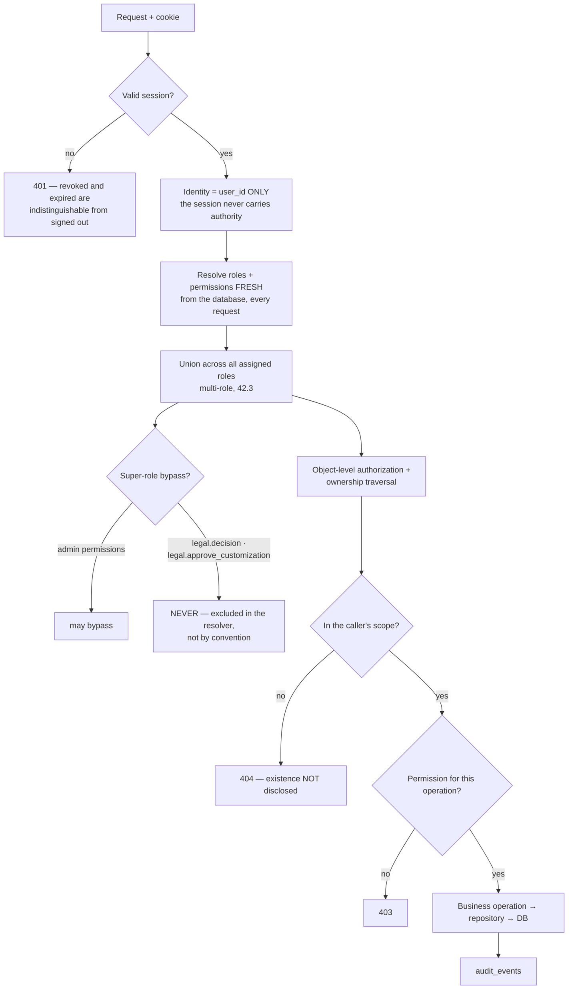
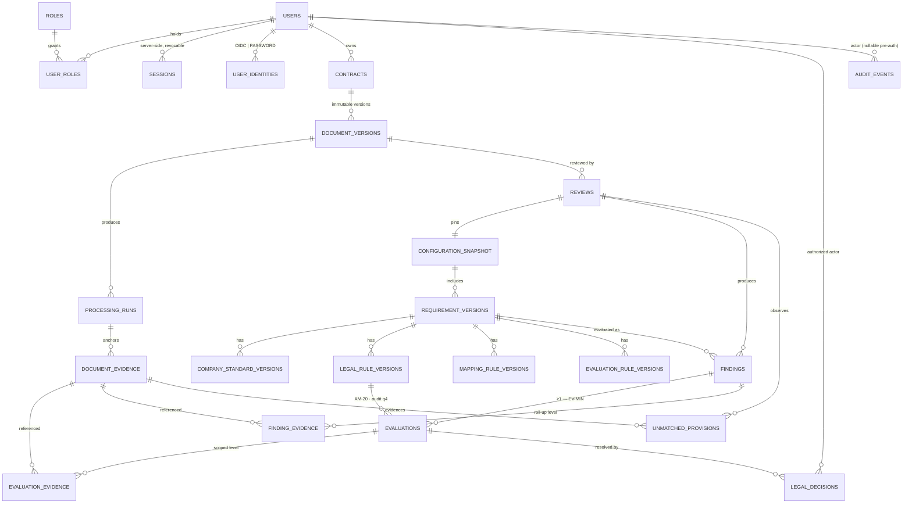
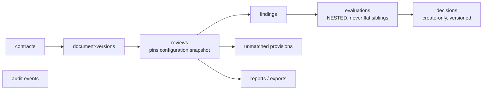

# LegalMind V1 — Architecture & System Flow Reference

**Status: 📁 NAVIGATIONAL REFERENCE — derives nothing, locks nothing.**

This document is a map of the locked V1 system for a developer joining the project. **It contains no decisions.** Every statement here is drawn from a locked specification and links back to it; where the specification is silent, the gap is marked `OPEN` or `IMPLEMENTATION DETAIL` rather than filled.

If this document and a specification disagree, **the specification wins** — and the discrepancy must be reported per [CLAUDE.md](../../CLAUDE.md) rule 5.

**Related:** [docs/README.md](../README.md) (documentation index) · [PROJECT_OVERVIEW.md](PROJECT_OVERVIEW.md) (what LegalMind is) · [LOCKED_DECISIONS.md](LOCKED_DECISIONS.md) (decision registry) · [IMPLEMENTATION_STATUS.md](IMPLEMENTATION_STATUS.md) (build state)

---

## 0. Source of truth by area

Read the map here; read the specification there. Nothing below is restated in detail.

| Area | Authoritative specification | Locked as |
|---|---|---|
| Domain boundaries, architectural rules | [SYSTEM_ARCHITECTURE.md](../05-architecture/SYSTEM_ARCHITECTURE.md) | Step 38 · `ARCH-01`–`ARCH-05` |
| Technology stack | [BACKEND_ARCHITECTURE.md](../05-architecture/BACKEND_ARCHITECTURE.md) | Step 39 · `ARCH-06` |
| Backend module structure, transactions | [API_ARCHITECTURE.md](../05-architecture/API_ARCHITECTURE.md) | Step 43 · `ARCH-07` |
| API surface, permissions, denial semantics | [STEP_49_API_FINALIZATION.md](../05-architecture/STEP_49_API_FINALIZATION.md) | Step 49 · `API-10` |
| Authentication, sessions, RBAC | [STEP_47_SECURITY_SPECIFICATION.md](../06-security/STEP_47_SECURITY_SPECIFICATION.md) | Step 47 · `SEC-01`–`SEC-09` |
| Ownership & visibility | [OWNERSHIP.md](../06-security/OWNERSHIP.md) | Step 24 · `ROLE-07` |
| Ingestion & parsing | [PROCESSING_PIPELINE.md](../03-document-model/PROCESSING_PIPELINE.md) | Step 34 · `DOC-03` |
| Requirement mapping | [REQUIREMENT_MAPPING.md](../04-analysis-engine/REQUIREMENT_MAPPING.md) | Steps 28, 35 · `ENG-01`–`ENG-03` |
| Analysis engine pipeline | [ANALYSIS_ENGINE.md](../04-analysis-engine/ANALYSIS_ENGINE.md) | Steps 36, 44 · `ENG-04`, `ENG-05` |
| Cross-evaluator contract | [EVALUATOR_EDGE_CASES.md](../04-analysis-engine/EVALUATOR_EDGE_CASES.md) | Step 45D |
| `LIABILITY-001` evaluator | [LIABILITY.md](../04-analysis-engine/EDGE_CASES/LIABILITY.md) · [LIABILITY_EVALUATOR_CONTRACT.md](../04-analysis-engine/EDGE_CASES/LIABILITY_EVALUATOR_CONTRACT.md) | Steps 45A, 45B, 45C |
| `PRESENCE` evaluator | [PRESENCE_EVALUATOR.md](../04-analysis-engine/EDGE_CASES/PRESENCE_EVALUATOR.md) | Step 45D |
| State vocabularies (five axes) | [DECISION_STATE_MODEL.md](../02-legal-domain/DECISION_STATE_MODEL.md) | `REC-06` · `FIND-11` |
| Finding classification | [FINDING_CLASSIFICATION.md](../02-legal-domain/FINDING_CLASSIFICATION.md) | Step 36 · `FIND-03` |
| Legal decisions & approval | [LEGAL_DECISIONS.md](../02-legal-domain/LEGAL_DECISIONS.md) | Step 31 · `LEGAL-12` |
| Review lifecycle | [WORKFLOWS.md](../01-product/WORKFLOWS.md) | Step 30 · `FIND-08` |
| Database schema & ERD | [DATABASE_MIGRATIONS.md](../09-implementation/DATABASE_MIGRATIONS.md) | Step 42 + AB-1 · `DATA-04` |
| Audit trail | [AUDIT_TRAIL.md](../07-audit/AUDIT_TRAIL.md) | Steps 25, 32 · `AUD-01`, `AUD-02` |
| Reproducibility | [REPRODUCIBILITY.md](../07-audit/REPRODUCIBILITY.md) | `AUD-04`, `AUD-05` |
| Frontend | [STEP_52_FRONTEND_ARCHITECTURE.md](../05-architecture/STEP_52_FRONTEND_ARCHITECTURE.md) | Step 52 · `FE-01` |
| Observability | [STEP_53_OBSERVABILITY.md](../09-implementation/STEP_53_OBSERVABILITY.md) | Step 53 · `OBS-01` |
| Testing | [STEP_54_TESTING_STRATEGY.md](../08-testing/STEP_54_TESTING_STRATEGY.md) | Step 54 · `TEST-10` |
| Deployment | [STEP_55_DEPLOYMENT.md](../09-implementation/STEP_55_DEPLOYMENT.md) | Step 55 · `DEP-01` |

> ⚠️ Four older topic documents still read `NOT YET SPECIFIED` for areas the Step-numbered documents above have since locked — `AUTHENTICATION.md`, `FRONTEND_ARCHITECTURE.md`, `TEST_STRATEGY.md`, `DEPLOYMENT.md`. Always check the successor. See [CLAUDE.md](../../CLAUDE.md) § Three traps.

---

## 1. Container & layer architecture

V1 is a **modular monolith with background workers** — explicitly *not* microservices (38.26). The architecture is designed so one layer cannot accidentally bypass another (38.1).



### The four architectural rules that shape everything

| Rule | Locked at | Consequence |
|---|---|---|
| Security boundary is server-side: **Authentication → Authorization → Business Operation → Database** | 38.21 · `ARCH-02` | Authorization happens at the API/service boundary, before any domain operation (43.23) |
| **No direct UI → database access** | 38.22 · `ARCH-03` | Every datum reaches the browser through `/api/v1/` |
| **No UI → analysis-engine shortcuts** | 38.23 · `ARCH-04` | One source of truth for legal evaluation; the UI renders results it never computes |
| API layer orchestrates; **endpoint naming explicitly not locked** | 38.24 · `ARCH-05` | Paths may change; the permission mapping may not |

### The ten domains (38.3)

`Identity & Access` · `Contract & Document Management` · `Document Processing` · `Legal Configuration` · `Requirement & Clause Mapping` · `Evaluation & Findings` · `Review Workflow` · `Legal Decisions` · `Audit & Version History` · `Reporting / Export`

### Technology per layer

Locked as the Step 39 **final stack table** only — the surrounding rationale is `RECOMMENDED`, not locked (see the note on `ARCH-06` in [LOCKED_DECISIONS.md](LOCKED_DECISIONS.md)).

| Layer | Technology |
|---|---|
| Frontend | Next.js + TypeScript |
| Backend / API | FastAPI + Python · Pydantic validation |
| Database | PostgreSQL |
| ORM / migrations | SQLAlchemy 2 + Alembic |
| PDF / DOCX / OCR | PyMuPDF · python-docx · OCRmyPDF + Tesseract |
| Background jobs | Celery + Redis |
| Object storage | S3-compatible |
| Authentication | OIDC/OAuth2-compatible provider |
| Authorization | Application-level RBAC + PostgreSQL constraints |
| Testing | Pytest + Playwright · Vitest (frontend) |
| Containers / proxy / CI | Docker · Nginx or equivalent · GitHub Actions |
| Monitoring | Sentry + structured application logs |

**No LLM, RAG, embedding model or vector database appears anywhere in the authoritative analysis path** (`AI-01`). Classical NLP such as spaCy is permitted in an assist-only role (`AI-03`). The architecture must remain *capable* of adding an assistive LLM layer post-V1 without redesign (`AI-02`, 38.25).

---

## 2. End-to-end request flow

From sign-in to a resolved Finding. Every arrow crossing into the API passes authentication then authorization first.



**Reading order for the detail:** authentication and authorization → [Step 47](../06-security/STEP_47_SECURITY_SPECIFICATION.md) · ingestion → [Step 34](../03-document-model/PROCESSING_PIPELINE.md) · review lifecycle → [Step 30](../01-product/WORKFLOWS.md) · decisions → [Step 31](../02-legal-domain/LEGAL_DECISIONS.md) · API contract → [Step 49](../05-architecture/STEP_49_API_FINALIZATION.md).

### Review lifecycle (axis 5, Step 30)

```text
DRAFT → UPLOADED → PROCESSING → ANALYSIS_COMPLETE → LEGAL_REVIEW → RESOLVED → CLOSED
Exceptions: ANALYSIS_FAILED · CANCELLED
```

`ANALYSIS_FAILED` is an **operational** failure and is alerted. `UNABLE_TO_EVALUATE` is **correct fail-closed behavior** and must never be alerted as an error (Step 53).

---

## 3. Analysis-engine flow

### 3.1 The chain that must never be short-circuited

Raw contract text is **never** converted directly into a Finding (44.1). Every Finding reconstructs as `Evidence → Fact → Standard → Rule → Result` (44.33, `ENG-08`).



**Mapping answers *which Requirement a clause relates to*; it never decides what the clause means** (`ENG-03`). The two are separate engines and separate persisted vocabularies.

| Layer | Persisted vocabulary | Axis |
|---|---|---|
| Mapping | `CONFIRMED` · `AMBIGUOUS` · `UNRESOLVED` | 1 |
| Evaluation | `MATCH` · `DEVIATION` · `MISSING` · `CONFLICT` · `AMBIGUOUS` · `UNRESOLVED` · `UNABLE_TO_EVALUATE` | 2 |
| Legal rule | `ACCEPTABLE` · `APPROVAL_REQUIRED` · `UNACCEPTABLE` · `NOT_APPLICABLE` | 3 |

> `AMBIGUOUS` means **three different things on three different layers**. The five axes must never share a status field or enum (`REC-06`, `FIND-11`). Read [DECISION_STATE_MODEL.md](../02-legal-domain/DECISION_STATE_MODEL.md) before naming any state value.

### 3.2 Requirement → Evaluation → Finding

A Requirement produces **one Evaluation per distinct governed scope** (45D.4.1). The Finding's `classification` is a **derived, non-authoritative summary** — the scoped Evaluations are authoritative (45B).



**EV-MIN:** every Finding has at least one Evaluation, enforced by a `DEFERRABLE INITIALLY DEFERRED` constraint trigger checked at COMMIT, with service validation retained as a fast-fail (AB-1.6).

### 3.3 Roll-up derivation (45B)

```text
TIER 1 — result cannot be relied upon (fail closed, ENG-09)
    UNABLE_TO_EVALUATE  >  CONFLICT  >  AMBIGUOUS  >  UNRESOLVED
TIER 2 — evaluated positions
    MISSING  >  DEVIATION  >  MATCH

Any Tier-1 scope dominates every Tier-2 scope.
```

A Finding must never read `MATCH` while any scope is unevaluable, contradictory or absent. **The ordering within Tier 1 is an engineering determinism convention only — not a legal hierarchy.** All four Tier-1 states route to human review and are legally equivalent in consequence; the order exists solely to satisfy `ENG-11` determinism.

### 3.4 Classification semantics

| Classification | Means | Evidence |
|---|---|---|
| `MATCH` | The customer provision conforms to the Company Standard (36.2) | ≥ 1 required |
| `DEVIATION` | Differs from the Standard. **Does not mean "unacceptable"** — acceptability is axis 3 (`FIND-05`) | ≥ 1 required |
| `MISSING` | An **expected** Requirement has no provision (36.4) | 0 permitted **only** from established absence |
| `CONFLICT` | Contradictory provisions within scope | ≥ 1 required |
| `AMBIGUOUS` | Meaning not deterministically resolvable | ≥ 1 required |
| `UNRESOLVED` | Mapping did not resolve | ≥ 1 if candidates exist |
| `UNABLE_TO_EVALUATE` | Extraction or evidence insufficient — **correct behavior, never a guess** (`ENG-09`) | ≥ 1 required |

**`RESOLVED ≠ MATCH`** — a resolved workflow state must never be recorded as a `MATCH` finding (`FIND-04`). **No synthetic evidence is ever created** (45D.4.10).

An optional Requirement with no mapped provision produces **no Finding and no Evaluation** (F-1) — `MISSING` is excluded because 36.4 requires the Requirement to be *expected*. Coverage reporting, not a Finding, answers "which clauses were reviewed".

`UNMATCHED_PROVISION` — a provision with no configured Requirement — is a **document-level observation** in its own table and must never occupy a Finding's `classification` (`REC-02`, `FIND-10`).

### 3.5 The twelve structural rules every evaluator obeys (45D.4)

Inherited by every evaluator, never restated per Requirement:

1. **Multiplicity** — one Evaluation per governed scope
2. **Scope precedes value** — no value is a legal position before what it applies to is established
3. **General position and exceptions are separate** — an exception never generalizes
4. **No silent commensurability** — differing units, bases or scopes are never equated without a configured deterministic conversion
5. **No silent precedence** — no positional, ordinal, source-based or confidence-based heuristic resolves competing provisions
6. **Deterministic cross-reference only** — preserved always, resolved only when deterministic; the referent's content is never inferred
7. **Negative and exception patterns are first-class**
8. **Absence is not a position** — absence yields `MISSING`, never a manufactured position
9. **Fail closed on unreliable input**
10. **Evidence survives every branch** — no synthetic evidence
11. **The evaluator produces no Legal Decision**
12. **Reproducibility** — evaluator version and Legal Rule version held relationally, Company Standard version via the Review's configuration snapshot, plus facts, diagnostics and evidence

**Precedence handling (F-6):** 45C.22 is narrowed to **configured precedence only**. In-document precedence language is detected, evidenced and reported — **never applied**.

### 3.6 The two locked evaluators

V1 minimum coverage is `LIABILITY-001` + the generic `PRESENCE` evaluator + configured Requirements. **No additional legal-domain evaluator is required by any locked decision.** `EVALUATOR_TYPE` is defined as exactly `NUMERIC_COMPARISON` and `PRESENCE` (AM-16).

#### `PRESENCE` — generic, specifies no legal area

Presence is established by the **mapping layer**, never by the evaluator. The evaluator reads no clause text and no patterns.

| mapping_state | applicability | classification | evidence |
|---|---|---|---|
| `CONFIRMED` | any | `MATCH` | ≥ 1 required |
| `NONE` | `REQUIRED` | `MISSING` | 0 permitted |
| `NONE` | `OPTIONAL` | *no Finding produced* | — |
| `AMBIGUOUS` | any | `UNABLE_TO_EVALUATE` | ≥ 1 required |
| `UNRESOLVED` | any | `UNABLE_TO_EVALUATE` | ≥ 1 if candidates exist |

An ambiguous or unresolved mapping must **never** be recorded as absence. `DEVIATION` is not producible by this evaluator.

#### `NUMERIC_COMPARISON` — `LIABILITY-001`

The one specified legal Requirement. Company Standard is 6 months; `6mo → MATCH`; `12mo → DEVIATION + ACCEPTABLE`; `>12mo → DEVIATION + APPROVAL_REQUIRED`; `UNLIMITED → DEVIATION + UNACCEPTABLE`; missing → `MISSING`; insufficient extraction → `UNABLE_TO_EVALUATE`; contradictory provisions → `CONFLICT`. Ambiguity is never silently resolved and carve-outs are never discarded. Full 21-rule policy in [LIABILITY.md](../04-analysis-engine/EDGE_CASES/LIABILITY.md); input/output contract in [LIABILITY_EVALUATOR_CONTRACT.md](../04-analysis-engine/EDGE_CASES/LIABILITY_EVALUATOR_CONTRACT.md).

> A Requirement carrying **both** a presence condition and value criteria is modelled as **two Requirements over the same clause** — `requirement_versions.evaluator_type` is singular (42.7).

> Termination, Indemnification and Governing Law are **NOT YET SPECIFIED**. They appear only in illustrative examples and are configuration, not specification.

---

## 4. Security & authorization flow



### Authentication (`SEC-01`, OD-9)

Corporate **SSO via OIDC** is primary; **password-based login** is a controlled fallback. Sessions are **server-side**, carry **`user_id` only**, and are revocable immediately. **Stateless JWT was explicitly rejected.** The hard rule: **the authentication mechanism never confers Legal Decision authority.**

### The ownership traversal (`SEC-06`, 41.24)

```text
Legal Decision → Evaluation → Finding → Review → Contract → owner/scope → User → Roles → Permissions
```

**Knowing an ID is never sufficient for access.** Collections apply the same object-level scope as single-resource reads (Step 49).

### Legal Decision authority (`SEC-05`)

Requires an **explicit grant** — never inherited, never implied, never reachable by bypass. `legal.review` does **not** confer `legal.decision`. Legal *configuration* authority does not confer Legal *Decision* authority. Checked at **Evaluation** level. Second-person approval is evaluated at Evaluation level and must be a different user (F-2). **A configuration change must never leave zero users holding `legal.decision`.**

### Permission catalogue (`SEC-04`)

```text
contract.view | create | update | delete
document.upload | view | download
review.create | view
finding.view | comment
evaluation.view
legal.review | legal.decision | legal.approve_customization
legal_position.view
configuration.view | draft | publish | deprecate
report.view | generate | export.generate
audit.view
user.manage | role.manage | platform.manage
```

Default grants follow Step 23's locked role summary. Catalogue additions are idempotent and never auto-granted to non-super roles.

> ⚠️ **C-10 — do not seed `roles` without reading this.** Step 42.2's "Initial roles" list (`USER` · `ADMIN` · `SUPER_ADMIN`) does not match the canonical Step 23 matrix (`User` · `Legal Reviewer` · `Legal Admin` · `Super Admin`) that these default grants are defined against. Both steps are locked. Unresolved — see [CONFLICTS.md](CONFLICTS.md) C-10.

### Security invariants S-1 – S-10

| | |
|---|---|
| S-1 | Authority resolved fresh per request; never trusted from the session |
| S-2 | Sessions revocable server-side; revocation immediate |
| S-3 | HttpOnly / Secure / SameSite cookies; CSRF protection on state changes |
| S-4 | Credential material never returned; excluded at the repository layer |
| S-5 | Rate limiting on authentication and expensive analysis endpoints |
| S-6 | Secrets outside source control; keys rotatable |
| S-7 | No account enumeration |
| S-8 | A user may not grant an authority they do not themselves hold |
| S-9 | The escalation guard covers granting, editing **and** deleting a more-privileged account |
| S-10 | Role–permission changes are transactional |

Authentication and authorization events go into the existing locked `audit_events`; `actor_id` is null for pre-authentication events. **No new audit table** (`SEC-09`).

---

## 5. Data & domain model

Locked in Step 42 (`DATA-04`) and amended by Batch AB-1. Schema design rules (`DATA-05`): UUID primary keys, UTC timestamps, foreign keys on important relationships, JSONB only for genuinely variable configuration. **No database-level "magic"** — legal evaluation logic stays in the application layer, never in triggers (42.22, `DATA-06`).



### Tables added or changed by AB-1 and Step 47

| Table | Change | Source |
|---|---|---|
| `evaluations` | `scope_key`, `scope_label`, `evaluation_kind`, `rule_outcome`, `evaluator_version NOT NULL`, `legal_rule_version_id`, `UNIQUE(id, finding_id)` | AM-8′, AM-19, AM-20 |
| `legal_decisions` | `evaluation_id NOT NULL`, composite FK `(finding_id, evaluation_id)`, `version_number` + `UNIQUE(evaluation_id, version_number)`, `justification TEXT NOT NULL` | AM-1, AM-12, AM-15 |
| `evaluation_evidence` | **new** — per-scope evidence; `PRIMARY \| SUPPORTING \| CONFLICTING`; **zero rows is a valid state** | AB-1.5 |
| `unmatched_provisions` | **new** — `REC-02` document-level observations | AB-1.5 |
| `sessions` | **new** — `user_id`, `created_at`, `last_seen_at`, `expires_at`, `revoked_at`, `revoked_reason` | Step 47 |
| `user_identities` | **new** — `provider (OIDC\|PASSWORD)`, `provider_subject`, `credential_hash`; `UNIQUE(provider, provider_subject)`, `UNIQUE(user_id, provider)` | Step 47 |
| `EVALUATOR_TYPE` | defined: `NUMERIC_COMPARISON`, `PRESENCE` | AM-16 |
| `FINDING_STATUS` | defined: `OPEN`, `DECISION_REQUIRED`, `AWAITING_CLARIFICATION`, `RESOLVED` | J-4 |

`finding_evidence` is retained unchanged as the Finding-level roll-up. Extraction diagnostics are carried inside `evaluations.result` (JSONB), satisfying `REC-07` — they are diagnostic metadata and **cannot independently produce or alter a legal finding**.

### Integrity constraints that carry legal weight

| Constraint | Enforcement |
|---|---|
| `findings UNIQUE(review_id, requirement_version_id)` | Database |
| **EV-MIN** — every Finding has ≥ 1 Evaluation | Deferred constraint trigger at COMMIT + service fast-fail |
| **Evidence cardinality** — non-empty evidence required for `MATCH`, `DEVIATION`, `CONFLICT`, `AMBIGUOUS`; empty permitted **only** for `MISSING` from established absence | Service layer (spans two tables, 42.21) |
| Decision version collision → `409` | `UNIQUE(evaluation_id, version_number)` |
| Audit trail append-only | `AUD-01` |

### The five traceability paths (42.20)

Every Finding is simultaneously traceable to: **Review → Document Version → Contract**; **Evidence → Document Version → page/section**; **Requirement Version → Company Standard Version → Legal Rule Version**; **Evaluation → Evaluation Rule Version**; and **Legal Decision → authorized User**.

---

## 6. API surface

Locked in Step 49 (`API-10`). **Endpoint naming is explicitly outside the locked boundary (38.24) — the permission mapping is normative.** Do not treat any path below as a locked string.

### Conventions

```text
Base path   /api/v1/                                    (43.30)
Resources   plural nouns, kebab-case, UUID identifiers
Verbs       GET / POST / PATCH / DELETE   — PUT is not used
Timestamps  ISO-8601 UTC                                (41.27)
Envelope    { data } | { data, pagination } | { error } (43.21)
Every response carries X-Request-Id.
```

**Every endpoint declares exactly one required permission. No endpoint is implicitly public.** `legal.approve_customization` is required *in addition to* `legal.decision` when `decision_type = APPROVE_CUSTOMIZATION`.

### Resource hierarchy



### The six locked response rules

1. Evaluations are **nested under the Finding**, never flat siblings.
2. `findings.classification` is a **derived summary** and is never returned without its evaluations.
3. **No Finding-level `rule_outcome` field exists** in any response. `requires_decision` is derived.
4. `evidence_refs` is **always an array and may be empty** (`MISSING` from established absence). It is **never null**.
5. `rule_outcome`, thresholds and `rule_configuration` are **omitted — not nulled** — for callers without `legal_position.view`.
6. **No response field can express a Legal Decision produced by the engine.**

### Decisions

```text
POST /evaluations/{id}/decisions      create · requires legal.decision
GET  /evaluations/{id}/decisions      full version chain
```

There is **no Finding-level decision endpoint** and **no decision update endpoint** — supersession is a create. `justification` is mandatory. A `UNIQUE(evaluation_id, version_number)` violation surfaces as **409**, providing optimistic concurrency without a separate ETag mechanism. Prior versions are never modified. **Resolving a Finding directly is rejected** — resolution is derived.

### Error taxonomy

| Code | Meaning |
|---|---|
| `401` | No valid session |
| `403` | Object visible, operation permission absent |
| `404` | Object outside the caller's ownership/visibility scope — **existence is not disclosed** |
| `409` | Conflict, including decision version collision |
| `422` | Business-rule rejection |
| `429` | Rate limit exceeded |

**A 404 for an out-of-scope object and a 404 for a non-existent object are byte-identical.** Any difference is an enumeration oracle. Error bodies never disclose internal legal position.

### Pagination, idempotency, correlation

`page_size` is clamped server-side to a maximum of **100** regardless of client input. Ordering is explicit and stable with a deterministic tiebreaker on `id`. Filters are an allow-list per endpoint.

Analysis submission accepts an `Idempotency-Key`; Review creation is idempotent on `(document_version_id, configuration_snapshot_id)`; Finding/Evaluation duplication is prevented by unique constraints. **Decision creation is deliberately *not* idempotent by key** — it is versioned, so a duplicate submission is a `409` rather than a silent no-op.

`X-Request-Id` is echoed on every response, included in every error body, recorded in the metadata of every audit event the request produces, and propagated into background analysis jobs.

---

## 7. Frontend behavior

Locked in Step 52 (`FE-01`). Three boundary rules, restated because the frontend is where they are most easily violated:

1. **The frontend never touches the database** (38.22) — all data via `/api/v1/`.
2. **The frontend never implements legal logic** (38.23) — no classification, no roll-up derivation, no rule evaluation, no `requires_decision` computation. Every such value is rendered as received.
3. **UI permission gating is presentation only** (47.6, 49.11). Hiding a control is a usability affordance, never a security control.

### Confidentiality rendering (`LEGAL-02`)

> A field omitted for lack of `legal_position.view` **renders as absent**. No placeholder, no "hidden", no lock icon — **a marker would itself disclose that an internal legal position exists.** An out-of-scope `404` renders identically to a non-existent one.

### Normal user vs legal-authorized view

| | Normal User | With `legal_position.view` / `legal.decision` |
|---|---|---|
| Finding classification | Visible | Visible |
| Evaluations under the Finding | Visible | Visible |
| `rule_outcome`, thresholds, `rule_configuration` | **Absent from the payload** | Present |
| Decision controls | Not rendered (and rejected server-side regardless) | Rendered at **Evaluation** level |
| Own Reviews | Accessible (`ROLE-07` r3) | Per Legal scope/assignment |
| Another user's Review | `404` — indistinguishable from non-existent | Per Legal scope/assignment |

A user can see the user-facing outcome of their own Legal review **without** seeing confidential internal Legal reasoning or thresholds (`ROLE-07` r11).

### Review screen (Step 31 r16 as amended by AM-6)

A Finding shows its derived classification **and** expands to its Evaluations — **never presented as a single verdict**. Decision controls attach to the **Evaluation**. A Finding cannot be resolved while any Evaluation requiring a decision lacks one. Decision history shows current vs superseded (Step 31 r20). **`RESOLVED ≠ MATCH` remains visible.**

**No optimistic UI for Legal Decisions — a `409` is a real outcome.**

`OPEN`: visual design, component library, accessibility target, internationalisation.

---

## 8. Observability, reproducibility & deployment

### Three record types, never conflated (Step 53)

| | Purpose | Store | Mutability | Audience |
|---|---|---|---|---|
| **Audit events** | What legally happened | `audit_events` (42.18) | **Append-only** (`AUD-01`) | Auditors, Legal |
| **Diagnostics** | Why the engine concluded | `evaluations.result` (`REC-07`) | Immutable with the evaluation | Engineers, explainability |
| **Operational logs** | What the system did | Log pipeline | Retention-bound | Operators |

**An operational log is never a substitute for an audit event. Log expiry must never remove auditable history.**

**Never logged:** credentials, `credential_hash`, session ids, OIDC tokens/codes; contract text or clause content; thresholds, rule outcomes, `rule_configuration`; anything making failed logins an enumeration oracle.

**Signals:** pipeline stage durations · evaluator runs by type/version · classification distribution · **fail-closed rate — a *falling* rate may indicate guessing, not improvement** · `ANALYSIS_FAILED` rate · auth failures and permission denials · decision throughput and age.

### Reproducibility

An historical Evaluation replays from persisted facts, evidence, `evaluator_version` and `legal_rule_version_id`; the Company Standard version resolves through the Review's configuration snapshot. Identical inputs + configuration snapshot + evaluator version → **byte-identical output**. No clock, random source, locale or environment variable may affect a result (`ENG-11`).

Publishing new configuration **never mutates an existing Review** (`AUD-04`); drafts never affect comparisons (`AUD-03`).

### Deployment (Step 55)

```text
Next.js → FastAPI → PostgreSQL + object storage + worker/queue → external OIDC
```

**Workers run the same image as the API** — a version skew would break `evaluator_version` reproducibility, so they **deploy together**. No new technology; no microservices (38.26).

**Migration discipline:** historical legal records are never rewritten. Migrations touching legal data are **forward-only and additive**; destructive migrations require explicit approval. **Reproducibility must survive migration — verified as a release gate.** Configuration versions are never mutated in place. The application database role holds no DDL rights.

**Environments:** real contracts never leave production. Debugging uses correlation identifiers and diagnostics, **never data copies**.

**Production blockers register:** OIDC configured · secrets management · backup with **verified** restore · rate limiting · TLS and secure cookie flags · malware scanning available or explicitly accepted as absent · retention policy (`OPEN`) · export formats (`OPEN`).

### Release gates (Step 54)

The golden corpus is **Tier 1 and normative**. Every fixture asserts both the exact scoped Evaluation set and the derived Finding summary — never the roll-up alone — and pins configuration versions and `evaluator_version`. **A changed expected output is a specification change**, reviewed as such, never edited to make a build pass. The corpus runs in full on any mapping, extraction or evaluation change.

**Authorization tests are release-blocking:** IDOR matrix → `404` for out-of-scope objects · out-of-scope and non-existent `404`s byte-identical · permission matrix of every endpoint × every role · a super-role holder without `legal.decision` cannot decide by any route · `legal.review` alone does not permit deciding · escalation guard covers grant, edit and delete · a change leaving zero `legal.decision` holders is rejected · without `legal_position.view` confidential fields are absent not null · a revoked session fails on the next request.

**Test data:** synthetic or cleared text only. **Real counterparty contracts never enter the repository.**

---

## 9. Locked / Open / Implementation Detail

### 🔒 Locked — do not change without explicit owner approval

Domain boundaries and architectural rules (Step 38) · technology stack table (Step 39) · backend module structure and transaction boundaries (Step 43) · database schema and ERD (Step 42 + AB-1) · ingestion and parsing (Step 34) · mapping mechanism and the three persisted mapping states (Steps 28, 35) · the layered engine and the seven classifications (Steps 36, 44) · the twelve structural evaluator rules and the `PRESENCE` evaluator (Step 45D) · `LIABILITY-001` policy, data contract and edge cases (Steps 45A–45C) · the five-axis state model (`REC-06`) · review lifecycle (Step 30) · legal decision vocabulary and workflow (Step 31) · ownership and visibility (Step 24) · security, sessions, permission catalogue and S-1–S-10 (Step 47) · API conventions, permission mapping, response rules and error taxonomy (Step 49) · frontend boundary and confidentiality rendering (Step 52) · observability record separation (Step 53) · testing strategy and release gates (Step 54) · deployment shape and migration discipline (Step 55).

### ⏳ Open — requires a decision; **do not infer**

| Item | Why it is open | Tracked in |
|---|---|---|
| **Scoring-band → mapping-state mapping** | Deliberately deferred by owner decision, 2026-08-16. It is **not** established whether `CANDIDATE-REVIEW` corresponds to `AMBIGUOUS`, `UNRESOLVED`, or neither | [CONFLICTS.md](CONFLICTS.md) C-02 |
| **`rule_configuration` shape and contents** | Named in 45B.9, locked as an explicit extension point; contents never specified | [LOCKED_DECISIONS.md](LOCKED_DECISIONS.md) §K |
| **Step 35 numerical weights and thresholds** | Explicitly illustrative, pending a representative contract set. Fail-closed defaults hold until calibrated | [REQUIREMENT_MAPPING.md](../04-analysis-engine/REQUIREMENT_MAPPING.md) |
| **Which Requirements ship in V1** (N-24b) | Legal/product scope. Configuration, not code | [DECISION_FINALIZATION.md](DECISION_FINALIZATION.md) |
| **Retention policy** | 41.26 defers it; blocks production | Step 55 register |
| **Export formats and delivery** | Blocks the export feature only | Step 49 · Step 55 |
| **Remaining security decisions** `OD-1`, `OD-5`–`OD-15` | `OD-9` closed by Step 47; the rest sequenced after it | [EXTERNAL_REFERENCE_AUDIT.md](EXTERNAL_REFERENCE_AUDIT.md) §16 |
| **Conflicts C-05–C-10** | Four low-severity, C-09 (HIGH), C-10 (MEDIUM — role vocabulary) | [CONFLICTS.md](CONFLICTS.md) |
| Granular legal-approval limits · password policy · MFA · multi-tenancy | Explicitly `NOT YET SPECIFIED` by Step 47 | Step 47 |
| Termination, Indemnification, Governing Law and every other evaluator | No locked decision requires them | [EDGE_CASES/](../04-analysis-engine/EDGE_CASES/) |

### 🔧 Implementation detail — decided at build time, within locked constraints

Exact endpoint paths (naming outside the locked boundary, 38.24) · OpenAPI generation · rate-limit thresholds (deployment configuration) · `document_evidence.source_type` and `legal_decisions.decision_type` enum values ("finalized during implementation") · physical realization of the logical evaluator contracts · coverage targets, framework selection, CI topology · log aggregation technology and alert thresholds · hosting platform, orchestration, CI/CD tooling, object-storage provider, monitoring stack, DR objectives · golden-corpus fixture authoring (**requires real source material — see [CLAUDE.md](../../CLAUDE.md) rule 21**) · coverage reporting, overall-alignment aggregation and the risk display mapping (F-8, F-9, reporting layer) · `UNMATCHED_PROVISION` surfacing · visual design, component library, accessibility target, internationalisation.

---

## 10. Standing constraints

These hold in every layer and do not relax when implementation begins ([IMPLEMENTATION_READINESS_GATE.md](../09-implementation/IMPLEMENTATION_READINESS_GATE.md) §6):

1. No LLM, RAG, embeddings or vector search in the authoritative analysis path (`AI-01`).
2. The engine never produces a Legal Decision.
3. `RESOLVED ≠ MATCH`. `DEVIATION ≠ unacceptable`.
4. Fail closed — never guess, never silently resolve ambiguity, never discard a carve-out.
5. Evidence survives every branch; **no synthetic evidence** is ever created.
6. Server-side authorization is authoritative; UI gating is presentation only.
7. Authentication never confers Legal Decision authority.
8. Historical legal records are never rewritten.
9. Never invent a legal requirement, threshold or evaluator behavior.
10. A changed golden-corpus expectation is a specification change, not a test fix.
11. Real legal source material is requested, never manufactured.

**Implementation requires explicit approval.** This document describes a specified target, not built work — see [IMPLEMENTATION_STATUS.md](IMPLEMENTATION_STATUS.md) for actual build state.
