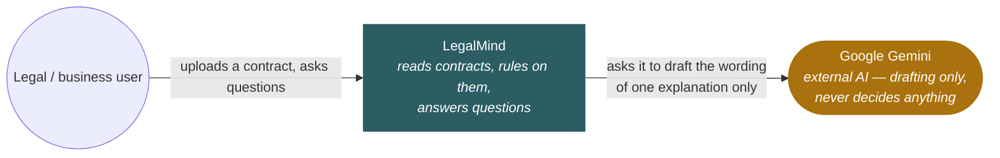
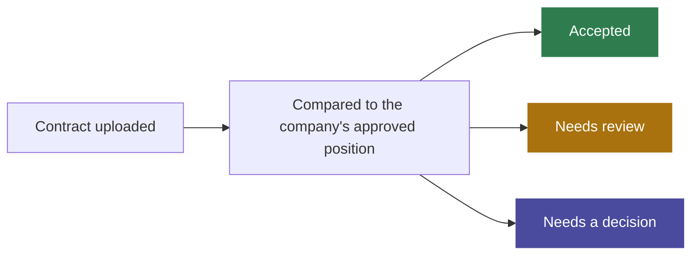
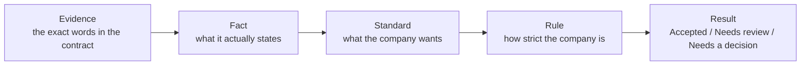
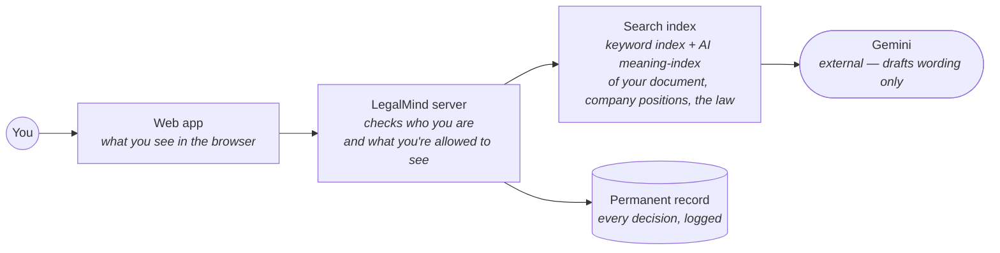
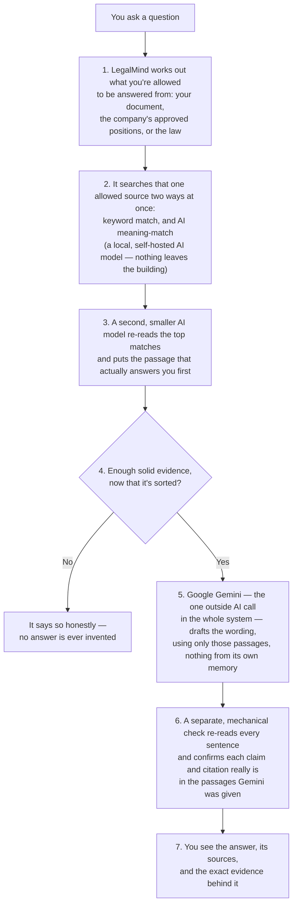

# LegalMind, explained simply

**Status: 📁 Plain-language explainer — not a specification, decides nothing.** If anything
here disagrees with [ARCHITECTURE_REFERENCE.md](ARCHITECTURE_REFERENCE.md),
[ASK_TARGET_ARCHITECTURE.md](ASK_TARGET_ARCHITECTURE.md) or
[CLAUDE.md](../../CLAUDE.md), those win. Written so no software background is needed to
read it. Four sections, one diagram each.

**Diagram format: the [C4 model](https://c4model.com)** (Context → Container → Dynamic),
the standard way engineers draw software architecture (Simon Brown; widely used across
the industry, e.g. ThoughtWorks). It's built to zoom out for a non-technical reader and
zoom in for a developer — this document deliberately stops at **Container**, the level
the model itself says is still readable by anyone. The deeper levels (Component, Code)
are for developers and live in [ARCHITECTURE_REFERENCE.md](ARCHITECTURE_REFERENCE.md)
instead.

---

## 1. The big picture (C4 Level 1 — System Context)

Who uses LegalMind, and the one outside system it ever talks to:

Inside that one box, every contract clause lands in exactly one of three buckets —
nothing is silently skipped, and nothing is silently approved:

---

## 2. How it decides — and why you can trust the verdict

LegalMind's core is **deterministic**: same contract, same company rule, same answer,
every time. No AI, no guessing, anywhere in this part. Every verdict traces backwards,
link by link:

**Current policy is zero tolerance.** A match is Accepted. Any difference — even a small
one — is never auto-approved. It always goes to a person. There is no "close enough"
setting, by deliberate choice.

---

## 3. Ask — the AI assistant that explains, but never decides (C4 Level 2 — Container)

**Ask** is the chat assistant in LegalMind — ask it anything in plain English or Hindi.
The one rule that governs it: **it can look things up and explain, but it can never rule
on anything.** Whether a document meets the company's standard is always Section 2's
call — Ask can only quote that verdict, never invent one of its own.

The moving parts inside LegalMind that make that happen:

And the exact sequence one question goes through — never a memory lookup, always a
fresh search first (this pattern is called **RAG**, retrieval-augmented generation):

Step 3, the re-reading model, is the newest piece and the one that moved the needle
most: on the team's 77-question test set it took "the right passage came up first"
from 61% to 73%. Step 6 is why nothing streams word-by-word like a typical chatbot —
the whole answer is checked before any of it is shown.

| | The Deciding Engine (Section 2) | Ask, the assistant (this section) |
|---|---|---|
| Job | Rules Accepted / Needs review / Needs a decision | Answers questions, explains, finds sources |
| How | Fixed rules — same input, same output, always | Searches the real text, drafts an answer, verifies it |
| Can it rule on compliance? | Yes — that's its only job | **Never.** It can quote a ruling, never make one |

---

## 4. Why you can trust it, and where things stand

- **Nothing leaves the building that shouldn't.** The only outside call anywhere in the
  system is Gemini drafting an Ask answer's wording — and only after the search step
  above has already limited it to text you're allowed to see.
- **Permission is checked on every single request**, not just at login. Lose access to a
  document or a company position and you stop seeing it immediately — old Ask
  conversations included.
- **Every action is logged, permanently**, on a record that can't be edited afterwards.
- **A human always makes the actual legal call.** LegalMind classifies, explains and
  cites — it never approves a contract on the company's behalf.

**Where the project stands today:** the core (Sections 1–2) has been live and in daily
use for weeks. Ask (Section 3) is live too, answering from over 70 company positions
drawn directly from the company's own Legal Constitution, and keeps getting more
accurate — but nothing about Sections 1–2, or the "never decides" rule in Section 3, has
ever changed.

For the full technical picture: [ARCHITECTURE_REFERENCE.md](ARCHITECTURE_REFERENCE.md)
(system end to end, down to Component/Code level) and
[ASK_TARGET_ARCHITECTURE.md](ASK_TARGET_ARCHITECTURE.md) §0 (Ask's real ten-stage
pipeline, of which this document's Dynamic diagram is the plain-language version).
