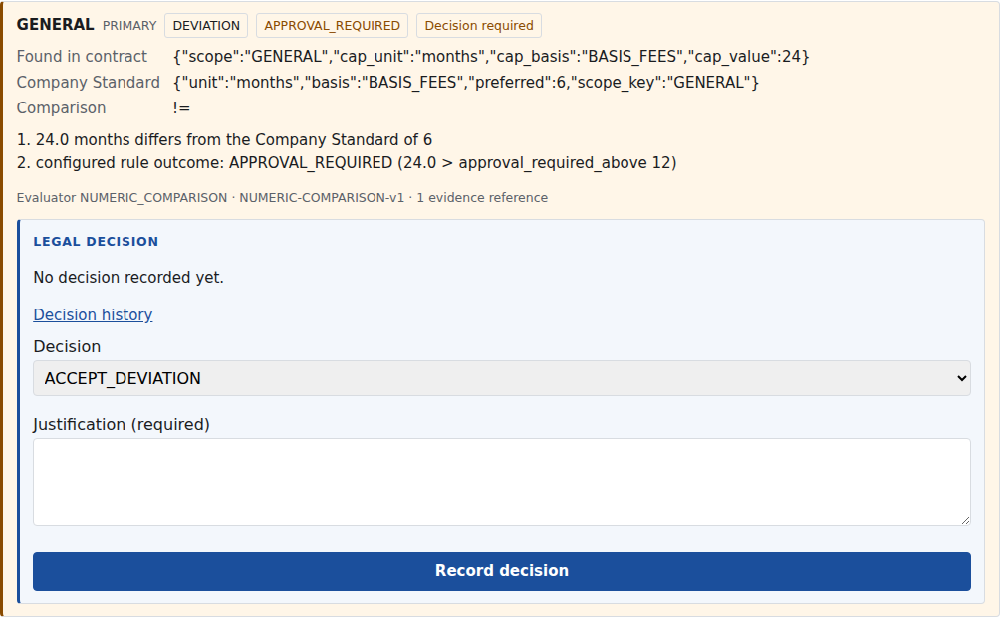
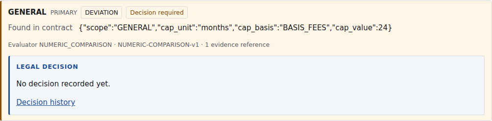
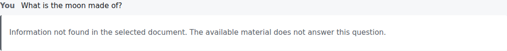

# UI Patterns — the deliberately unusual ones

**Status: 📁 REFERENCE, 2026-08-27.** Governed by [../../DESIGN.md](../../DESIGN.md). This
document explains the interface patterns that *look wrong to a newcomer but are correct by
design*, so a future contributor (or support person fielding a "the UI is broken" ticket)
finds the reasoning before "fixing" a security property. Each pattern names the locked
rule it implements — this document decides nothing of its own.

Screenshots are captured from the real application against the synthetic e2e fixture
(never real legal material — locked 54.6/55.3) and regenerate reproducibly:

```
cd frontend && DOCS_SHOTS=1 npx playwright test e2e/docs-screenshots.spec.ts
```

---

## 1 · Confidential omission — hidden fields are *absent*, never marked

**What you'll observe:** two users open the same Evaluation. A Legal Reviewer sees the
rule outcome; an ordinary user's row is simply **shorter** — no lock icon, no greyed
placeholder, no "restricted" chip, no tooltip. Nothing indicates anything was withheld.

| Legal Reviewer (`legal_position.view`) | Ordinary user |
|---|---|
|  |  |

**Why:** a marker saying "something is hidden here" *is itself a disclosure* — it confirms
an internal legal position exists on exactly this clause, which is the information
`LEGAL-02` protects. The API therefore **omits** the field rather than nulling it
(49.7 r4), and the UI renders what it received (52.4). The two views are structurally
different views, not one view with a mask.

**The rule for contributors:** never key UI on "field is null means restricted." Absence
is the only signal, by design, and adding any visual placeholder for an omitted field is
a security regression, not a UX improvement. The same discipline applies to 404s: an
object out of scope renders byte-identically to one that doesn't exist (`API-10`,
49.5 r1) — so error copy must never say "you don't have access to this."

---

## 2 · The refusal state — "not found" looks the same for every cause

**What you'll observe:** ask the assistant something the document doesn't answer and the
reply is a calm, plain sentence in the normal conversation flow — no red banner, no error
icon, no retry button:

> *Information not found in the selected document. The available material does not answer
> this question.*



And — the part that surprises people — the wording is **byte-identical whether** the
retrieval found nothing, found something too weak to answer from, the generated draft
failed citation verification, or the AI-generation gate is closed entirely (as it is in
production today, `AM-31`).

**Why, in two halves:**

* **A refusal is the system working, not failing** (`AM-29`). The product's core promise
  is "no answer without a source"; the moment a refusal renders as an error, users learn
  to distrust refusals and rephrase-until-it-answers — the exact behavior that erodes the
  guarantee. So the refusal sits on the quiet surface (`.ask-answer--refusal`), styled as
  content.
* **Identical wording regardless of cause** (`AM-29` r4): if "no evidence in your scope"
  read differently from "no evidence exists," the difference itself would leak what the
  requester is not authorized to see — the same oracle the byte-identical 404 closes at
  the HTTP layer. The UI must never decorate the states apart; the machine-readable
  `answer_state` exists for audit, not for display differentiation.

**The rule for contributors:** all refusal text flows from one backend constant; the
frontend renders `result.text` and must not branch its copy, color, or iconography on
*why* the refusal happened. The one styled distinction permitted is the evaluator-routing
reply (`routed_to_evaluator` — a pointer to the Review screen, `AM-25` r4), which is not
a refusal at all.

---

## 3 · Related patterns, briefly (each documented where it lives)

| Pattern | Looks like | Actually is | Rule |
|---|---|---|---|
| Missing buttons | "Where's the decision button?" | A control the caller can't invoke isn't rendered — not disabled, not tooltipped | 52.3 |
| Frozen decision form after a conflict | "The form locked up" | A 409 means someone else decided first; the form thaws only after an explicit refresh of the latest state | 52.7, [DecisionPanel.tsx](../../frontend/src/components/DecisionPanel.tsx) |
| `a`/`r` shortcuts that "don't work" | "I pressed approve and nothing was recorded" | Correct — shortcuts *prepare* (preselect + focus justification); only the explicit submit records a legal act | Step 31 r11, [shortcuts.ts](../../frontend/src/lib/shortcuts.ts) |
| A resolved Finding still showing DEVIATION | "Stale badge?" | `RESOLVED ≠ MATCH` — workflow state and classification are separate axes, both always shown | rule 14, Step 30 r8 |
| Plain "retrieval score 0.712" | "Why not a percentage/confidence bar?" | A retrieval score is a property of the query, labelled as exactly that; confidence figures are forbidden and CI-gated | rule 12, `AI-03` item 16 |
